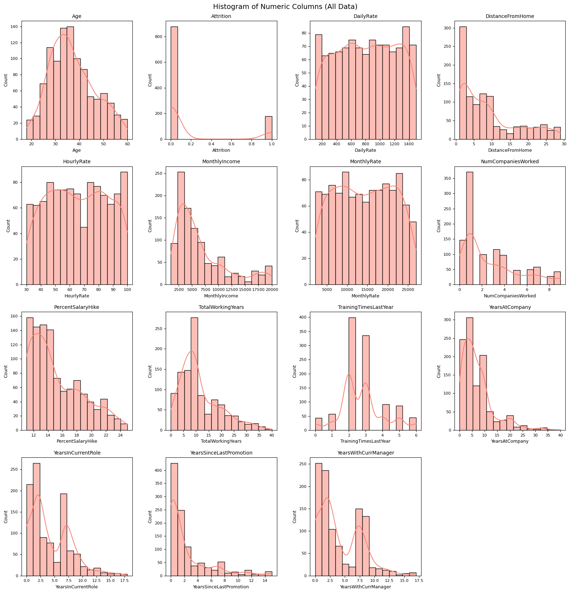
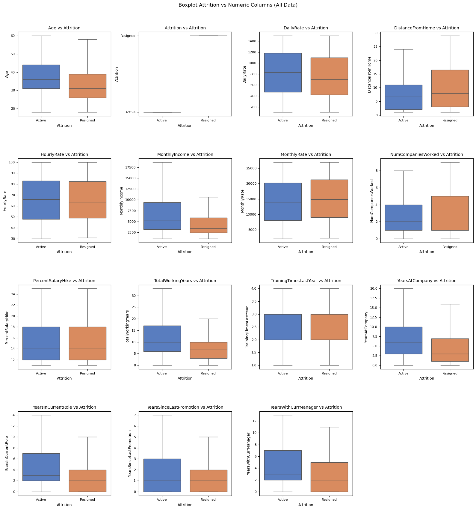
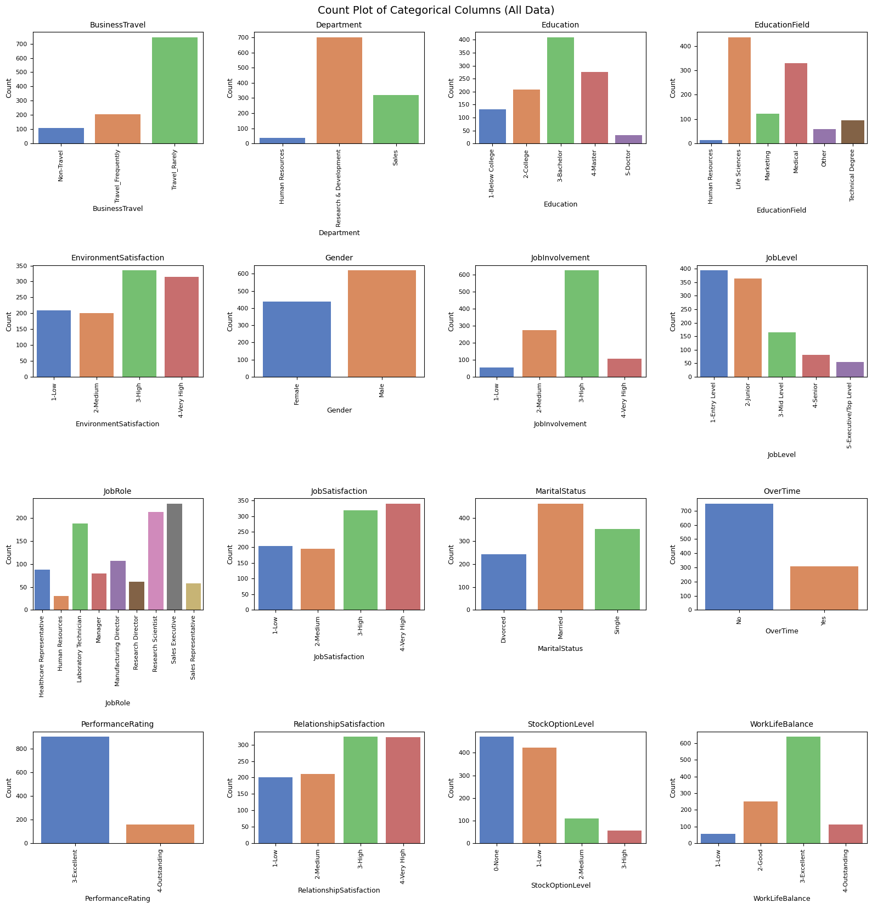
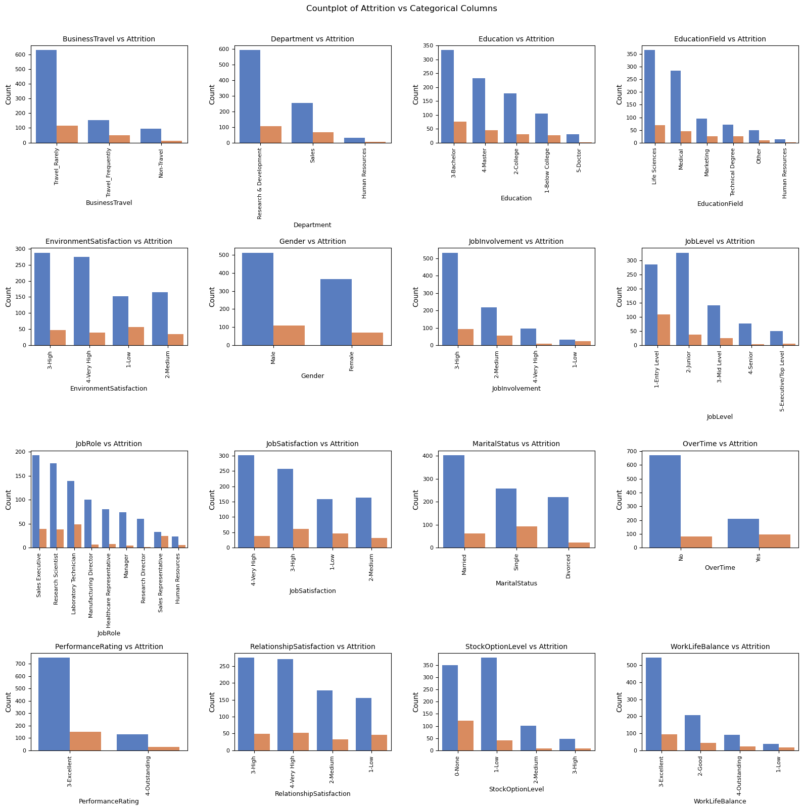
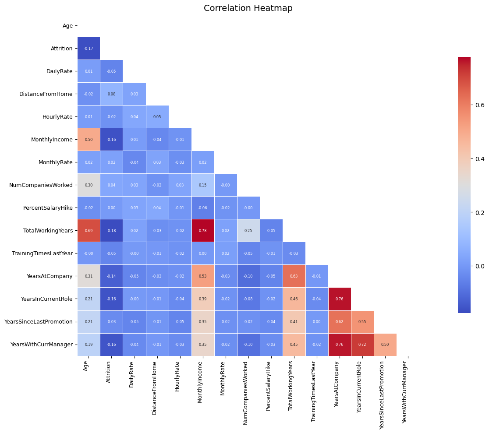
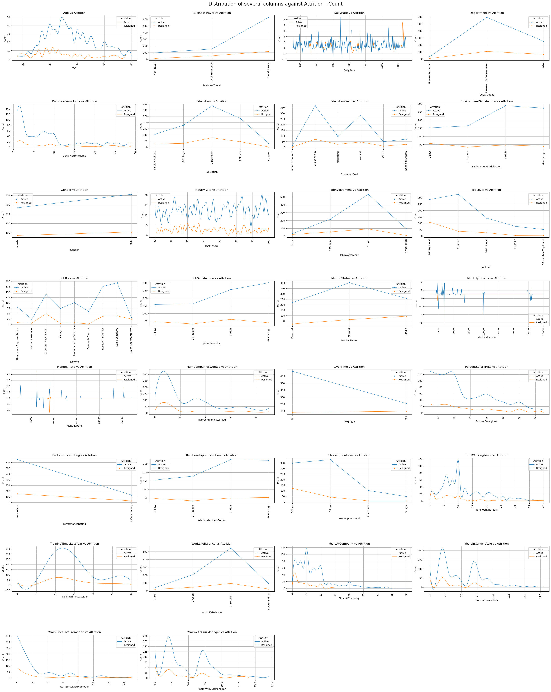
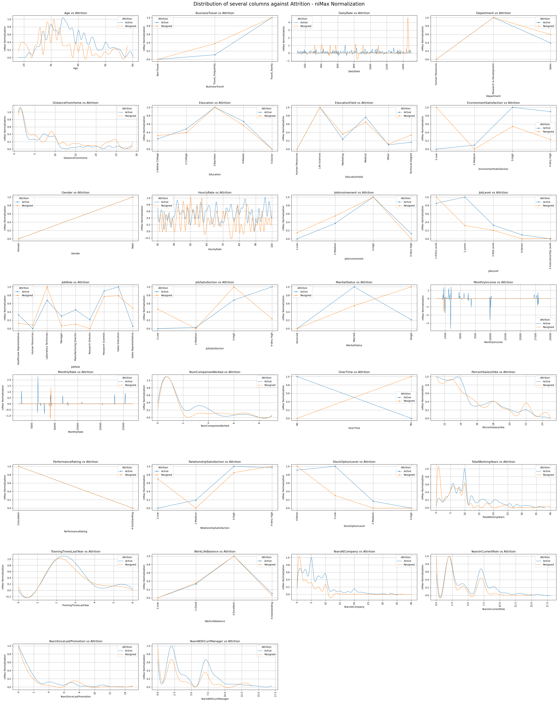
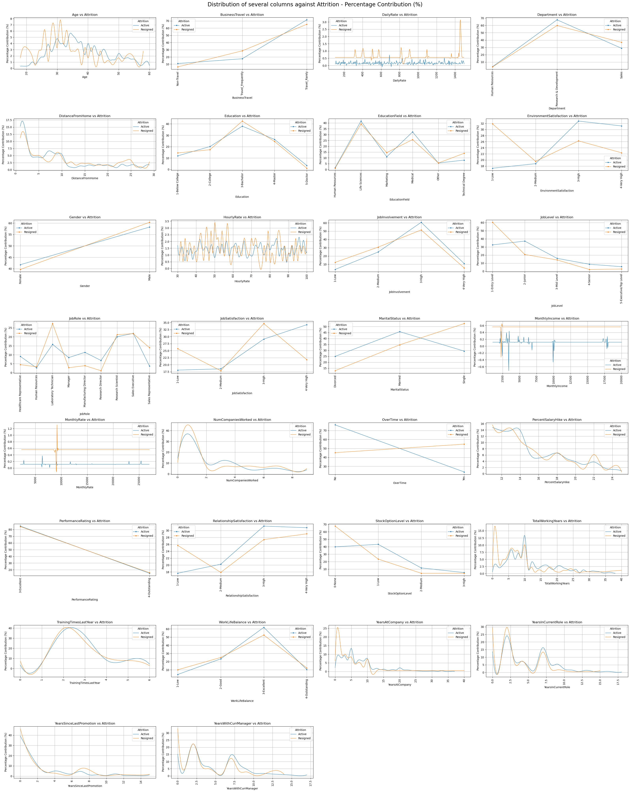
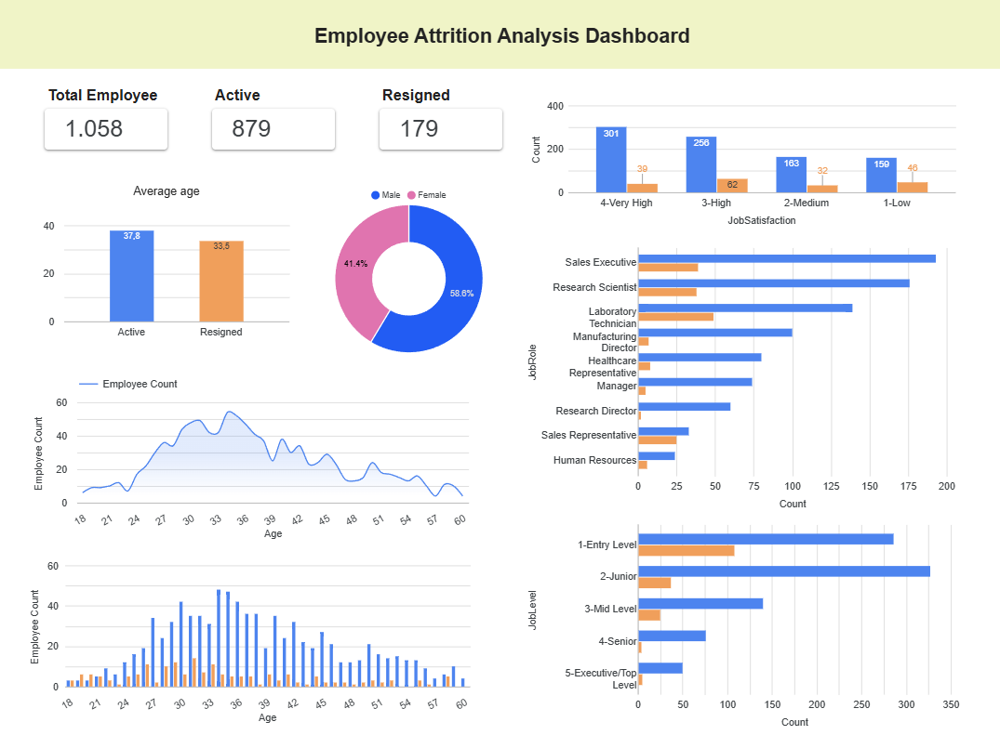

# Solving Human Resources Issues

## Business Understanding
Jaya Jaya Maju is a multinational company that has been operating since 2000 and has more than 1,000 employees scattered throughout Indonesia. As a large company, Jaya Jaya Maju certainly has the need to maintain the stability and productivity of its workforce in order to remain competitive in the market. One important aspect of human resource management is the employee retention rate. Unfortunately, despite the company's rapid growth, they face serious challenges in maintaining that retention rate, marked by a fairly high attrition rate, which is over 10%.

### Business Issues
The high attrition rate risks reducing productivity, increasing recruitment and training costs for new employees, and can affect the morale and overall performance of the team. HR management does not yet have an effective monitoring system to analyze the patterns and factors influencing employee turnover. Without a proper understanding of the root causes of attrition, efforts to reduce these numbers become inefficient and reactive.
 
### Preparation

#### Source of data

**Employee Data**

The data contains demographic details, work-related metrics and attrition flag.

- **EmployeeId** - Employee Identifier
- **Attrition** - Did the employee attrition? (0=no, 1=yes)
- **Age** - Age of the employee
- **BusinessTravel** - Travel commitments for the job
- **DailyRate** - Daily salary
- **Department** - Employee Department
- **DistanceFromHome** - Distance from work to home (in km)
- **Education** - 1-Below College, 2-College, 3-Bachelor, 4-Master, 5-Doctor
- **EducationField** - Field of Education
- **EnvironmentSatisfaction** - 1-Low, 2-Medium, 3-High, 4-Very High
- **Gender** - Employee's gender
- **HourlyRate** - Hourly salary
- **JobInvolvement** - 1-Low, 2-Medium, 3-High, 4-Very High
- **JobLevel** - Level of job (1 to 5)
- **JobRole** - Job Roles
- **JobSatisfaction** - 1-Low, 2-Medium, 3-High, 4-Very High
- **MaritalStatus** - Marital Status
- **MonthlyIncome** - Monthly salary
- **MonthlyRate** - Monthly rate
- **NumCompaniesWorked** - Number of companies worked at
- **Over18** - Over 18 years of age?
- **OverTime** - Overtime?
- **PercentSalaryHike** - The percentage increase in salary last year
- **PerformanceRating** - 1-Low, 2-Good, 3-Excellent, 4-Outstanding
- **RelationshipSatisfaction** - 1-Low, 2-Medium, 3-High, 4-Very High
- **StandardHours** - Standard Hours
- **StockOptionLevel** - Stock Option Level
- **TotalWorkingYears** - Total years worked
- **TrainingTimesLastYear** - Number of training attended last year
- **WorkLifeBalance** - 1-Low, 2-Good, 3-Excellent, 4-Outstanding
- **YearsAtCompany** - Years at Company
- **YearsInCurrentRole** - Years in the current role
- **YearsSinceLastPromotion** - Years since the last promotion
- **YearsWithCurrManager** - Years with the current manager

**Acknowledgements**

[IBM Watson Analytics Use Case for HR Retaining Valuable Employees](https://www.ibm.com/communities/analytics/watson-analytics-blog/watson-analytics-use-case-for-hr-retaining-valuable-employees/)


#### Import the module and dataset

```python
import os
import time
import warnings
# ignore warning
warnings.filterwarnings("ignore")

%load_ext autoreload
%autoreload 2

import pandas as pd
import numpy as np
import matplotlib.pyplot as plt
import seaborn as sns

# Set pandas display options to maximize output visibility
pd.set_option("display.max_columns", None)
pd.set_option("display.max_colwidth", None)
pd.set_option("display.width", 0)
pd.set_option("display.expand_frame_repr", False)

# Import dataset
datasource = "dataset/employee_data.csv"
employee_df = pd.read_csv(datasource,encoding='windows-1252')


```
### Data Analysis Exploration

#### Visualization

#### Histogram Plot
Displaying the distribution of all numeric columns. 


---

##### Boxplot
Displaying the distribution and outliers in the numeric column. 


---

##### Count Plot
Distribution of categories from all categorical columns.  
  
Distribusi berdasarkan status attrition.  


---

##### Correlation Heatmap
Displaying the correlation between numeric columns.  


---

##### Metricplot






---

## Business Dashboard

This business dashboard is created using a platform **Google Looker Studio**. 


The dashboard can be accessed through the following link: 
🔗 [lookerstudio.google.com/s/grjGn3AvSms](lookerstudio.google.com/s/grjGn3AvSms)
